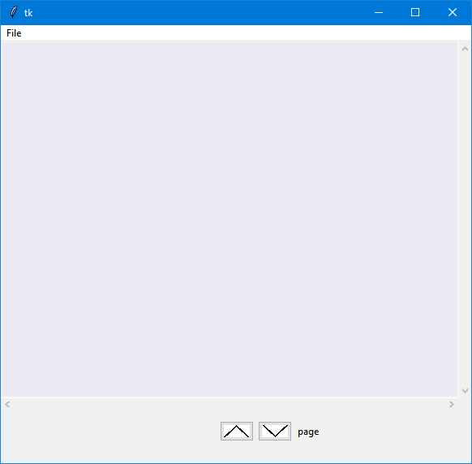
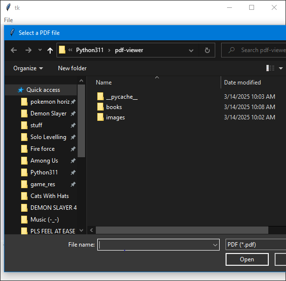
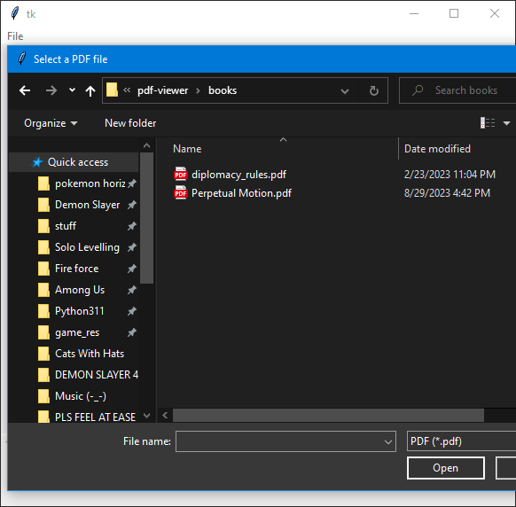
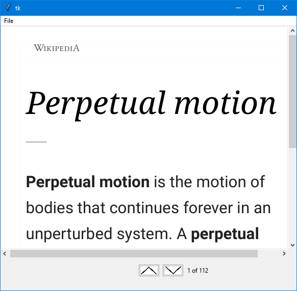

# PDF-Viewer
A python PDF viewer I am making. Here are some pictures of what it looks like now:
 

You run pdf-viewer to open it and you'll need to pip install pymupdf before you can run it. Enjoy!
